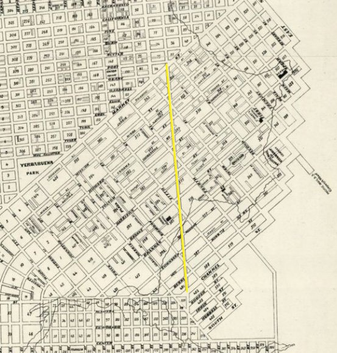

# New New Montgomery Street

Zoomable slippy map of a proposed extension of Montgomery St from 1868, which would have run south from Market St through SOMA to Connecticut St. 

https://burritojustice.github.io/new_new_montgomery_st/

made with Tangram and [XYZ Studio](https://xyz.here.com/studio)

Thanks to @[datapointed](https://twitter.com/DataPointed/status/1096493114322124800) for pointing it out!

Map via David Rumsey:

https://purl.stanford.edu/cx298pr4007

Learn more about "Montgomery Street Straight" here: http://www.foundsf.org/index.php?title=The_Silver_Era,_1860-1870

