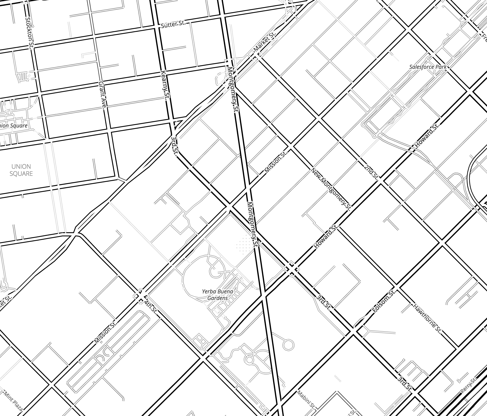

# Montgomery Street Straight

Zoomable slippy map of a proposed extension of Montgomery St from 1868, which would have run south from Market St through SOMA to Connecticut St. 

https://burritojustice.github.io/montgomery_street_straight/

map screenshot:

made with [Tangram](https://tangrams.readthedocs.io/en/latest/) and [XYZ Studio](https://xyz.here.com/studio)

Thanks to @[datapointed](https://twitter.com/DataPointed/status/1096493114322124800) for pointing it out!

Map via David Rumsey:

https://purl.stanford.edu/cx298pr4007

Learn more about "Montgomery Street Straight" and other real estate schemes here: http://www.foundsf.org/index.php?title=The_Silver_Era,_1860-1870

## Montgomery Street Straight

> The heady prospect of San Francisco’s peninsula becoming the terminus for the transcontinental railroad, coupled with the new flow of capital from the Comstock, injected new life into real-estate speculation, especially schemes affecting the southern waterfront. The rallying cry of real-estate promoters of the ’60s was “Montgomery Street Straight!”

> The possibility of connecting the financial district by a broad avenue directly to the Potrero and Mission Bay opened dizzy possibilities for promoting real estate. The idea was to extend Montgomery Street diagonally as a wide thoroughfare to the southern part of the city, joining Connecticut Street in the Potrero to the Montgomery Street financial district. Hittel reports: “This scheme was carried through the supervisors and passed over the mayor’s veto; commissioners were appointed, and they made an elaborate report, with the estimate of the expense, but the engineer in laying off the map of the work, assumed incorrectly that the blocks intersected were exactly of the size proposed in the original survey. The consequence was that the lines of the new street were not straight, but showed a little offset like a saw-tooth at every crossing. This defeated the enterprise.”

## How-to

- use [HERE XYZ Studio](https://xyz.here.com/studio) to draw your fictional road segment
- import Refill as a basemap into [Tangram](https://tangrams.readthedocs.io/en/latest/) and bring your road in as a data source using the [HERE XYZ API](https://xyz.api.here.com/hub/static/swagger/#/)
- borrow the road styles from [Refill](https://github.com/tangrams/refill-style) and use XYZ Studio to give your fictional road segment Tilezen-style road attributes so Refill will think OMG THIS ACTUALLY A REAL ROAD LET ME DRAW IT:

  - `kind: major_road`
  - `kind_detail:	primary`
  - `min_zoom:	8`
  - `name:	Montgomery St`
  - `sort_rank: 380`
 
- [Tangram Play](https://play.tangram.city/?scene=https://raw.githubusercontent.com/burritojustice/montgomery_street_straight/master/scene.yaml#15.7583/37.7789/-122.4026) helps big time
- the XYZ vector tile endpoint is super helpful during development -- you make a change and presto, it shows up right away in Tangram. Depending on the size and number of features, when you're done, you might want to export it or use the API to just pull the feature rather than vector tiling it at every zoom level
- disabling the ` buildings` layer makes it look better, though it's fun to keep it a z18 just so you can imagine how many Flatiron type building would have been built in SOMA
- profit!

## Screenshots for posterity

because all online maps eventually break

